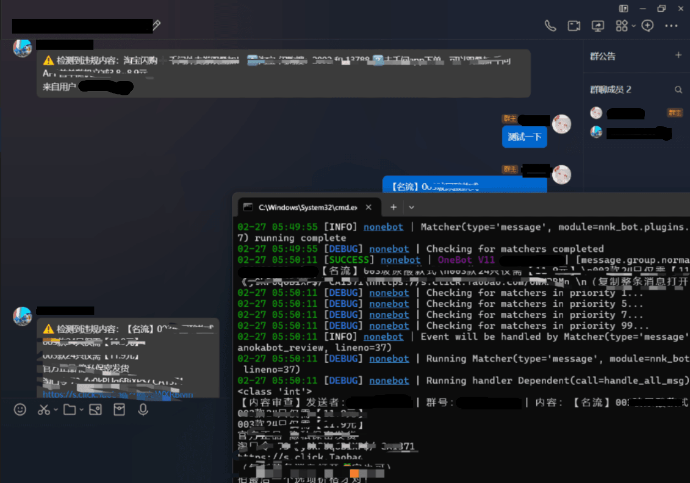

# 内容审查机器人

使用 `nonebot` 的 `内容审查 bot`, 基于 `Bert` 和 `Llama`



### 部署方法 (需要一些前置知识)

下载 `bert-base-chinese` 的时候建议用镜像站

```bash
git clone https://hf-mirror.com/google-bert/bert-base-chinese
```

在此之前你需要先安装好 `requirements.txt` 内的所有内容到你的 `python` 环境内

```bash
# Windows 下使用激活环境
.venv\Scripts\activate.bat

pip install -r requirements.txt
```

需要编译很久, 主要是 `llama-cpp-python` 要自己编译而且 `llama` 也不小

需要自己打包成文件夹 `nonebot_plugin_{这里填你要起的名字}` 然后放进 `plugin` 文件夹就可以了

`nb create` 之后会自动帮你创建 `plugin` 文件夹的

之后直接 `cmd` 正常启动就可以了

```bash
# 如果你不对源码进行修改也可以不 reload
nb run --reload
```

---

### Bert + Deepseek 分类器介绍

如你所见, 这里集成了 `Bert` 和 `Deepseek` 的后端, 只是 `Deepseek` 的后端运行的效果很糟糕

就像这样👇

```
0	是
0	否, 内容没有违规。
0	否
0	是, 这段文本违规内容是“我穿毛衣就是很难受里面必须要穿个打底衫”。
0	否。这段文本没有包含任何长广告, 因此不违规。
0	是, 内容中包含长广告, 可能影响群聊氛围。
0	否
0	是
0	是。违规内容是“可计算数”。
0	否。这段文本没有涉及任何长广告, 内容是正常的自我介绍。
0	是。这段文本包含了长广告"又看一集", 这属于影响群聊氛围的内容。
0	是, 违规内容是不发广告不刷屏。
0	是, 违规内容是这条长广告导致的负面情绪和用户怀疑广告虚假。
0	否
0	否。这段内容没有涉及任何长广告或违规内容。
0	是, 违规内容是“队友接近率更高”。
0	是, 违规内容是“斗不去把攻角限制关了吗”。
```

左边是原数据的真实情况, 而右边是 `Deepseek` 胡诌的, 这就是我为啥不用 `Deepseek-r1` 做分类了

**其实主要是 Bert 训练效果也不差**, 避免出现了误判的问题, 由于数据集有较大的倾斜

所以训练报告长下面这样, 有问题的精确度高而召回率低, 没问题的精确率稍低但召回率高

p.s. 如果长期打扰到也是不太好的行为...

```
混淆矩阵:
[[23  0]
 [ 2  1]]

分类报告:
              precision    recall  f1-score   support

           0       0.92      1.00      0.96        23
           1       1.00      0.33      0.50         3

    accuracy                           0.92        26
   macro avg       0.96      0.67      0.73        26
weighted avg       0.93      0.92      0.91        26
```

---

### 具体判断逻辑

所有工具最后都封装到 `review.py` 内了

可以直接使用一个函数解决这些问题👇

```python
class Review():

    # 此处省略一大堆字

    def func(self, text: list):
        '''
        我们根据句子长度决定是否使用 LLM 去判断
        较长的句子一般也不会太频繁的请求, 所以怎么处理归最终部署管理即可
        为了防止逆天使用超长模型还是加了判断
        '''
        ret = None
        if len(text) > self._length:
            print("使用 Deepseek + Bert 判断")
            ret = self.deepseek_predict(text=text, max_len=512)
        else:
            print("使用 Bert 进行判断")
            # min 一下, 谁知道有没有人用逆天模型
            ret = self.bert_predict(text=text, max_len=min(512, self._length))
        return ret
```

有一些 `Python` 基础的用户不难看出这一段代码在文本长度不同时有不同的策略

|方案|优点|缺点|
|----|----|----|
|Bert|运算速度快、非线性分割效果好|现实情况太复杂, 不能保证一定可分|
|Deepseek + Bert|模型容量大, Hidden 状态远超 Bert|不稳定, 而且这个参数太小|

反正就是不同的方案有不同的特点, 没有说确定哪一个就比哪一个一定好, 不然另一个早就被淘汰了

之后在 `__init__.py` 对接好 `nonebot2` 的 `api` 就可以正常使用了

### 接入 ChatGLM

在我们的 `agent.py` 中有一个类专门管理大模型后端, 叫 `LargeLanguageModelManager`

它可以让你用上 `ChatGLM` 专用的 `zhipuai` 库, 稍微改一改就可以适配你的了！

```python
config = {
    'llm': {
        "llm-server": 'remote',
        "chatglm-api": "这里放进来你自己的 API Key",
        "prompt": r'E:\pandownload1\Projects\Nanoka-Nonebot2\nnk-bot\nnk_bot\plugins\nonebot_plugin_nanokabot_review\dataset\prompt.txt',
        "llama-path": r'E:\pandownload1\ML\Police\Project\models\DeepSeek-R1-Distill-Qwen-1.5B-Q8_0.gguf'
    }
}

# 这里选择的是 zhipuai, 也就是初始化的时候不会初始化 Deepseek 后端, 不会占用资源
model = LargeLanguageModelManager(llm_model='zhipuai', config=config)

# 如果你是在想不开想用本地服务
model.change_llm_model(new_model='deepseek-r1') # 从这里开始创建 DeepSeekServe 核心服务
```

但你还是要做一些小修改, 比如说模型👇

```python
class LargeLanguageModelManager():
    '''
    大语言模型接口类, 用于与语言模型进行交互
    同时负责管理语言模型相关内容
    '''

    # 此处省略好多文本

    def request_zhipuai_chatglm(self, content='') -> str:
        """
        请求 ZhipuAI 的 ChatGLM-4-Flash 模型进行对话
        直接返回单句话的回复内容, 不进行任何格式化处理
        """
        if len(content) == 0:
            return False, "内容不能为空"

        message = copy(self.prompt)
        message.append({"role": "user", "content": content})

        response = self.chatglm_model.chat.completions.create(
            model="glm-4-flash",   # 👈 看这里, 不看这里你会吃苦的
            messages=message,
        )

        return response.choices[0].message.content
```

### Bert 训练

如果你准备好了, 那么就开始训练 `Bert` 模型了

```bash
# 进入文件夹
cd nnk_bot\plugins\nonebot_plugin_nanokabot_review
# 开始训练过程
python bert.py
```

其实没啥难的, 主要还是你要自己去找训练集, 而且训练 `Bert` 的时候要尽量保证 $ lr \leq 10^{-5} $ 而且最后的 `classifier` 层按照你的数据个数进行适配, 一般来说 $ lr \approx 10^{-3} $, 能炼出好丹的参数就是好参数就是了...

训练的 Bert 模型还是可以的, 收敛的比较稳定, 只是能稳定地输出垃圾广告类型, 其他的黑话学习的效果不是很好...如果你真的想要去做这个的话, 我建议先收集一波你们群里发生的数据, 然后再进行训练

训练日志一般在控制台👇

```
BertForSequenceClassification LOAD REPORT from: bert-base-chinese
Key                                        | Status     |
-------------------------------------------+------------+-
cls.predictions.transform.LayerNorm.weight | UNEXPECTED |
cls.predictions.transform.dense.bias       | UNEXPECTED |
cls.seq_relationship.bias                  | UNEXPECTED |
cls.predictions.bias                       | UNEXPECTED |
cls.predictions.transform.dense.weight     | UNEXPECTED |
cls.seq_relationship.weight                | UNEXPECTED |
cls.predictions.transform.LayerNorm.bias   | UNEXPECTED |
classifier.bias                            | MISSING    |
classifier.weight                          | MISSING    |

Notes:
- UNEXPECTED    :can be ignored when loading from different task/architecture; not ok if you expect identical arch.
- MISSING       :those params were newly initialized because missing from the checkpoint. Consider training on your downstream task.
数据集统计： label
0    219
1     40
Name: count, dtype: int64
Epoch 1/60: 100%|██████████████████████████████████████████████████████████| 15/15 [00:01<00:00, 11.16it/s, loss=0.571]
Epoch 2/60: 100%|██████████████████████████████████████████████████████████| 15/15 [00:00<00:00, 23.02it/s, loss=0.578]
Epoch 3/60: 100%|███████████████████████████████████████████████████████████| 15/15 [00:00<00:00, 22.90it/s, loss=0.43]

... (共 54 条数据) ...

Epoch 57/60: 100%|██████████████████████████████████████████████████████████| 15/15 [00:00<00:00, 22.50it/s, loss=0.24]
Epoch 58/60: 100%|█████████████████████████████████████████████████████████| 15/15 [00:00<00:00, 22.69it/s, loss=0.199]
Epoch 59/60: 100%|█████████████████████████████████████████████████████████| 15/15 [00:00<00:00, 22.77it/s, loss=0.214]
Epoch 60/60: 100%|██████████████████████████████████████████████████████████| 15/15 [00:00<00:00, 22.68it/s, loss=0.21]
Testing: 100%|███████████████████████████████████████████████████████████████████████████| 2/2 [00:00<00:00, 29.03it/s]
(Y) 进行模型保存: models\classifier_only.pth
(N) 测试后再保存
(y/N)

--------------------- 人工测试模式（输入q退出）---------------------
输入要判断的内容: 你觉得呢？
E:\pandownload1\Projects\Nanoka-Nonebot2\nnk-bot\nnk_bot\plugins\nonebot_plugin_nanokabot_review\bert.py:221: UserWarning: To copy construct from a tensor, it is recommended to use sourceTensor.clone().detach() or sourceTensor.clone().detach().requires_grad_(True), rather than torch.tensor(sourceTensor).
  input_ids = torch.tensor(inputs['input_ids']).unsqueeze(0).to(device)
E:\pandownload1\Projects\Nanoka-Nonebot2\nnk-bot\nnk_bot\plugins\nonebot_plugin_nanokabot_review\bert.py:222: UserWarning: To copy construct from a tensor, it is recommended to use sourceTensor.clone().detach() or sourceTensor.clone().detach().requires_grad_(True), rather than torch.tensor(sourceTensor).
  attention_mask = torch.tensor(inputs['attention_mask']).unsqueeze(0).to(device)
E:\pandownload1\Projects\Nanoka-Nonebot2\nnk-bot\nnk_bot\plugins\nonebot_plugin_nanokabot_review\bert.py:223: UserWarning: To copy construct from a tensor, it is recommended to use sourceTensor.clone().detach() or sourceTensor.clone().detach().requires_grad_(True), rather than torch.tensor(sourceTensor).
  token_type_ids = torch.tensor(inputs['token_type_ids']).unsqueeze(0).to(device)
预测结果: 0
输入要判断的内容: 看起来还凑合
预测结果: 0
输入要判断的内容: +++sdfsfsajfkhhbsdkj
预测结果: 0
输入要判断的内容: i啊ui的规范和监控和时代步伐加快步伐就监控和嘎可接受对方根据客户
预测结果: 0
输入要判断的内容: 苦于应该是的疯狂进攻和葵花
预测结果: 0
输入要判断的内容: parser.add_argument('--max_len', type=int, default=50, help='句子最大长度')
预测结果: 0
输入要判断的内容: 淘宝闪购➕千问外卖券双叠加！ 1️⃣淘宝-闪购搜：2892 和 13788 2️⃣去千问app下单, 可以双叠加 千问APP首单随机立减3.8~8.9亓
预测结果: 1
输入要判断的内容: 你这瓜多少钱一斤啊
预测结果: 0
输入要判断的内容: 两块钱一斤
预测结果: 0
输入要判断的内容: q
分类头参数已保存到: models\classifier_only.pth
```

